# Linux STIG-Based System Hardening Project

## Project Overview

This project demonstrates hands-on Linux system hardening aligned with DISA STIG (Security Technical Implementation Guide) principles.

The objective was to secure an Ubuntu 24.04 LTS virtual machine by applying security controls related to:

- SSH hardening
- Password complexity enforcement
- Account lockout policies
- Password aging
- Sudo logging
- Audit logging
- File permission auditing
- Login banners

This project simulates a DoD-aligned secure configuration environment.

---

## Environment

- OS: Ubuntu 24.04 LTS
- Platform: Virtual Machine
- User: kevin
- Kernel: 6.8.x
- Architecture: aarch64

---

# 1️⃣ SSH Service Enablement

Enabled and verified OpenSSH service.

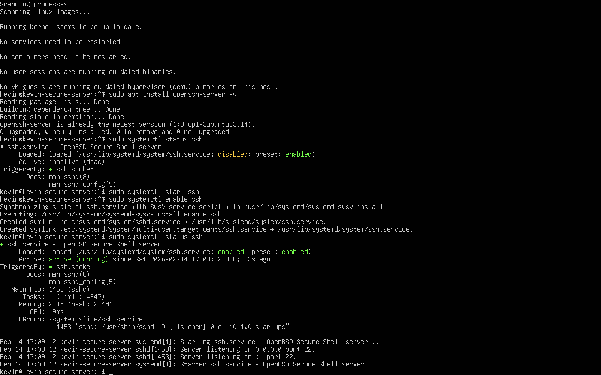

---

# 2️⃣ SSH Configuration Hardening

Modified `/etc/ssh/sshd_config` with STIG-aligned settings:

- PermitRootLogin no
- MaxAuthTries 3
- X11Forwarding no
- LoginGraceTime 30
- Banner /etc/issue.net

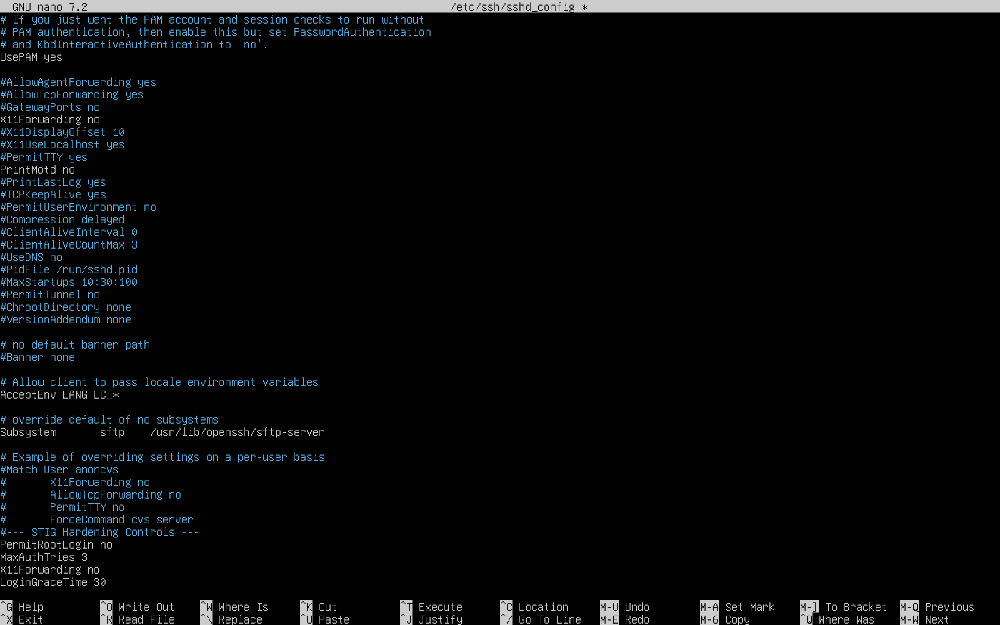

Restarted SSH service:

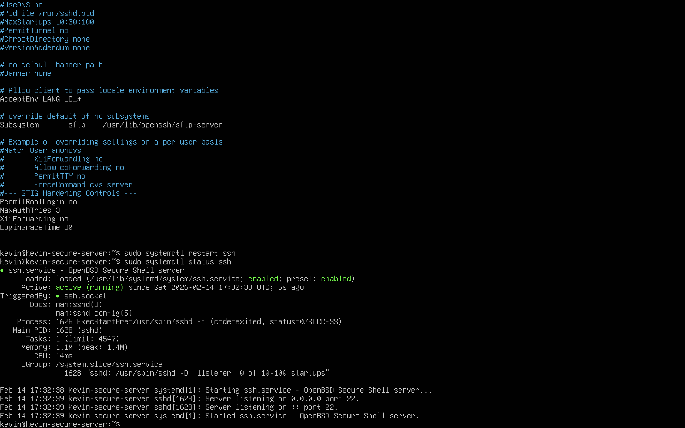

---

# 3️⃣ Login Banner Implementation

Created and verified a legal login banner.

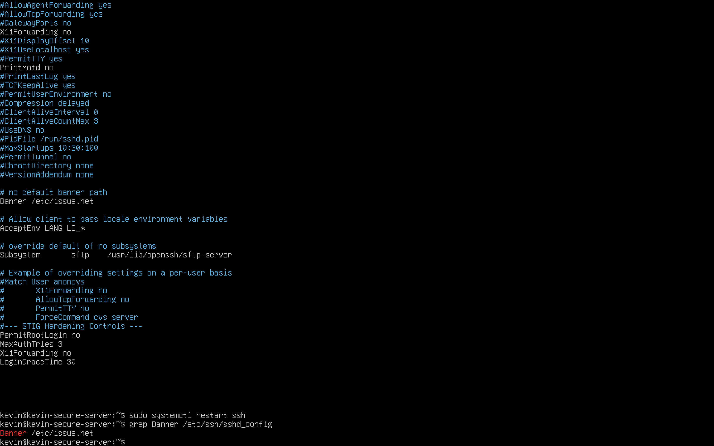

Verified banner configuration from remote connection:

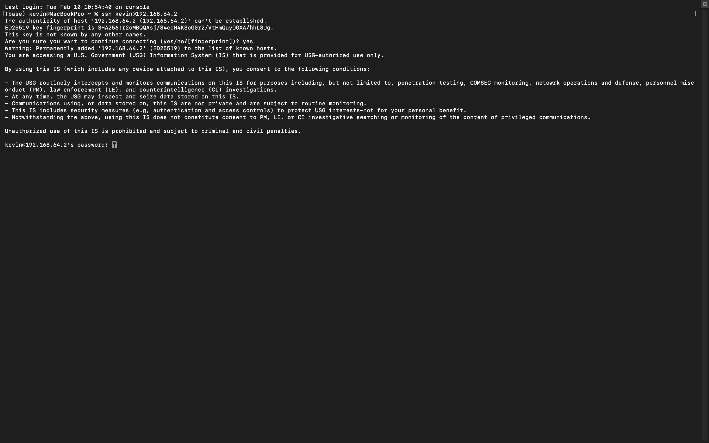

---

# 4️⃣ Password Complexity Enforcement (pwquality)

Configured `/etc/security/pwquality.conf`:

- minlen = 14
- difok = 4
- minclass = 4
- maxrepeat = 3

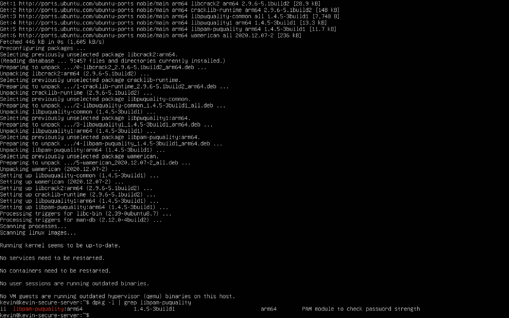

---

# 5️⃣ Password Aging Policy

Modified `/etc/login.defs`:

- PASS_MAX_DAYS 60
- PASS_MIN_DAYS 1
- PASS_WARN_AGE 7

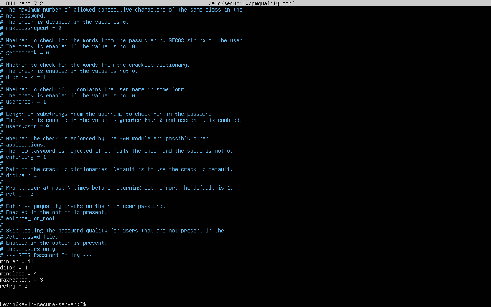

Verified settings:

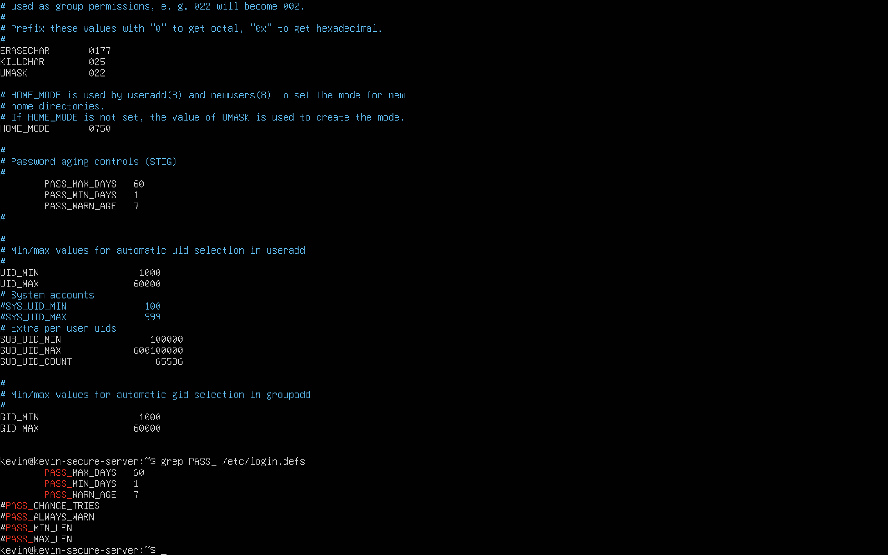

---

# 6️⃣ Account Lockout Policy (Faillock)

Configured `/etc/pam.d/common-auth` and `/etc/security/faillock.conf`:

- deny = 3
- unlock_time = 900
- audit

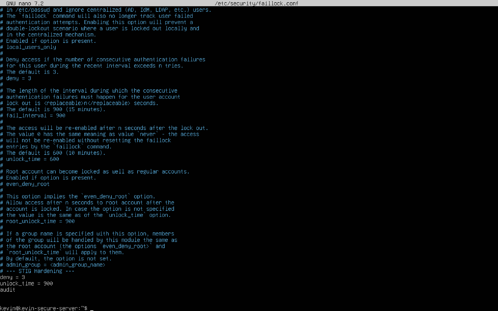

Verification:

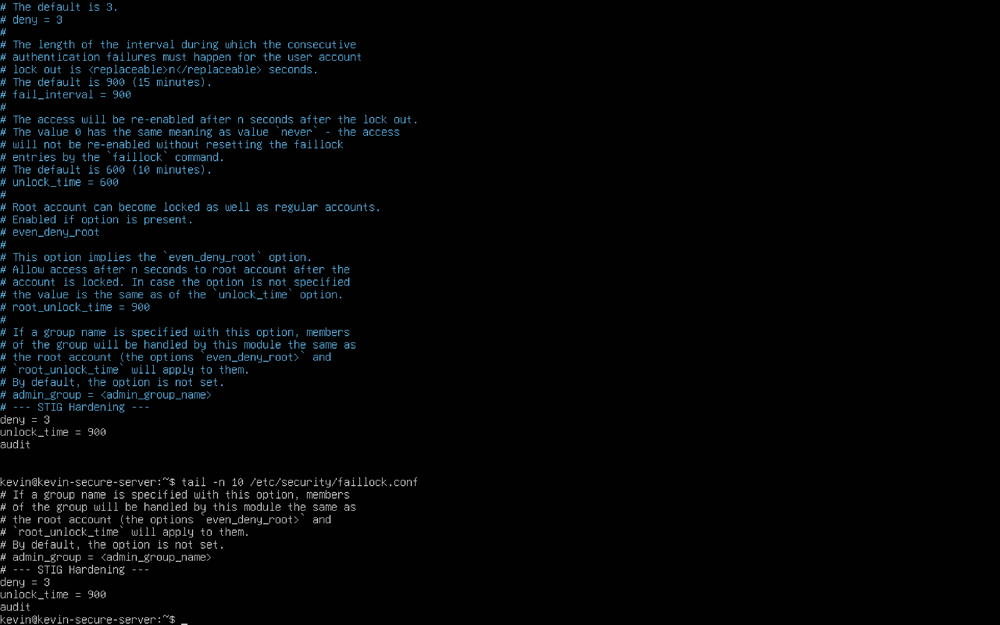

Confirmed root lock enforcement:

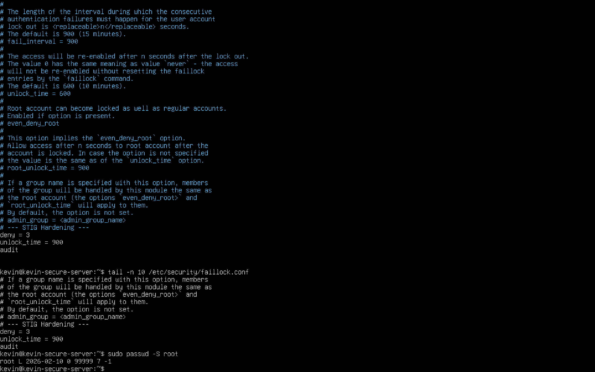

---

# 7️⃣ Sudo Logging Enforcement

Modified `/etc/sudoers` to log all sudo activity:

- Defaults logfile="/var/log/sudo.log"

Verified sudo logging:

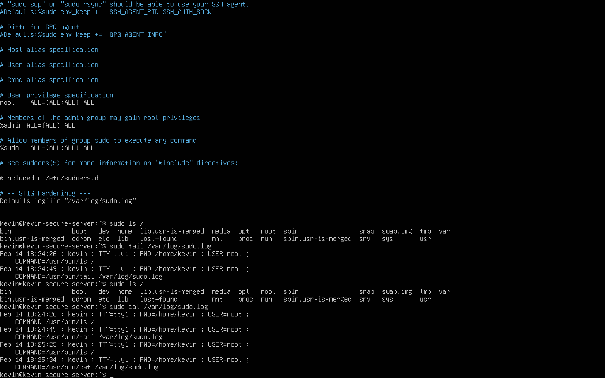

Log verification:

---

# 8️⃣ Auditd Enablement

Installed and enabled auditd service.

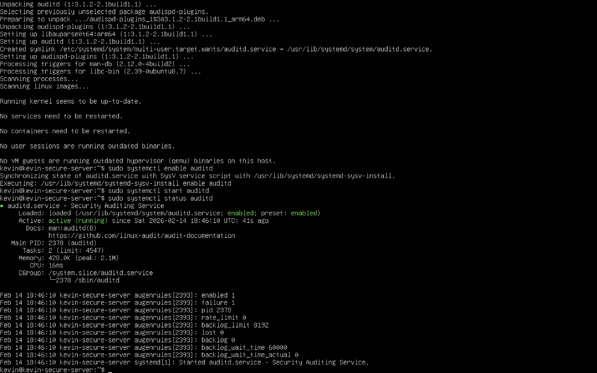

Verified audit logs:

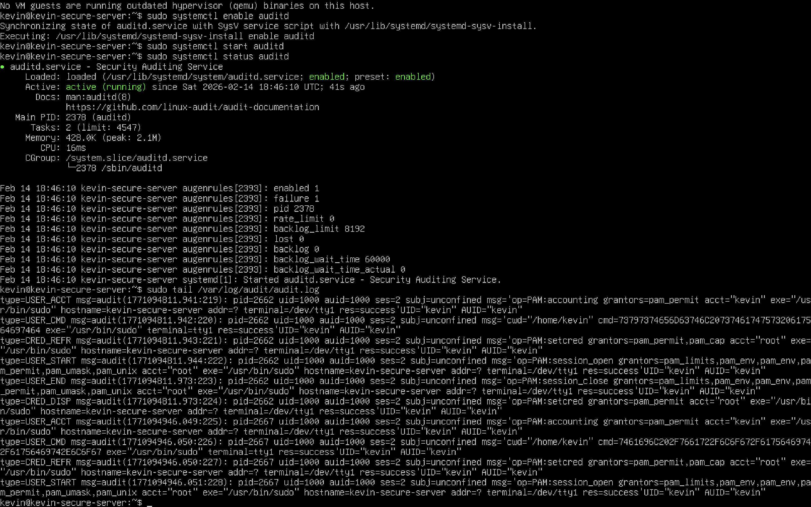

---

# 9️⃣ World-Writable File Scan

Scanned for insecure world-writable files:

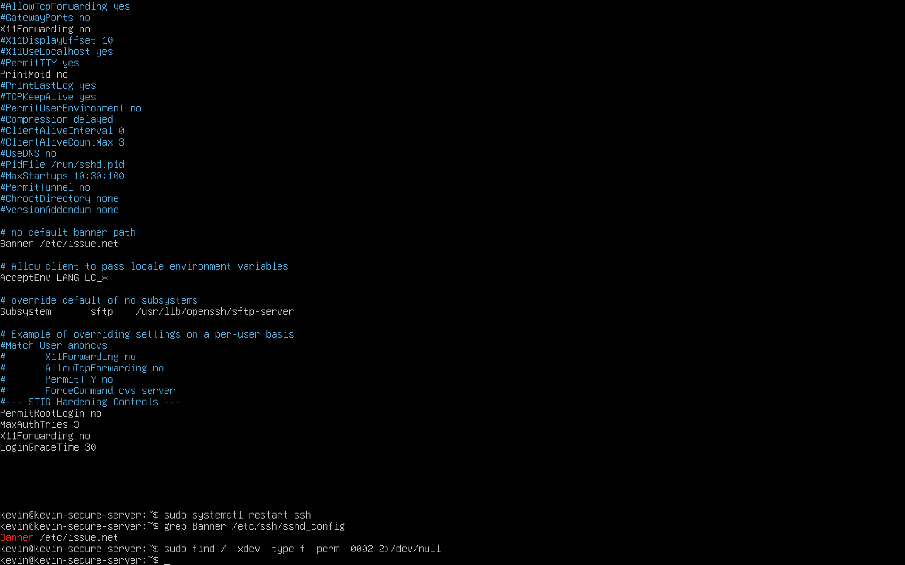

---

# Security Impact

The applied controls mitigate:

- Brute force attacks
- Privilege escalation
- Weak password usage
- Unauthorized root access
- Insider misuse
- Lack of audit visibility
- Improper file permissions

This configuration significantly improves system security posture and aligns with STIG hardening standards.

---

# Skills Demonstrated

- Linux system administration
- STIG interpretation and implementation
- SSH hardening
- PAM configuration
- Account lockout mechanisms
- Audit logging configuration
- Sudo policy enforcement
- File permission auditing
- Security documentation

---

# Author

Kevin Minaya  
Cybersecurity Professional  
